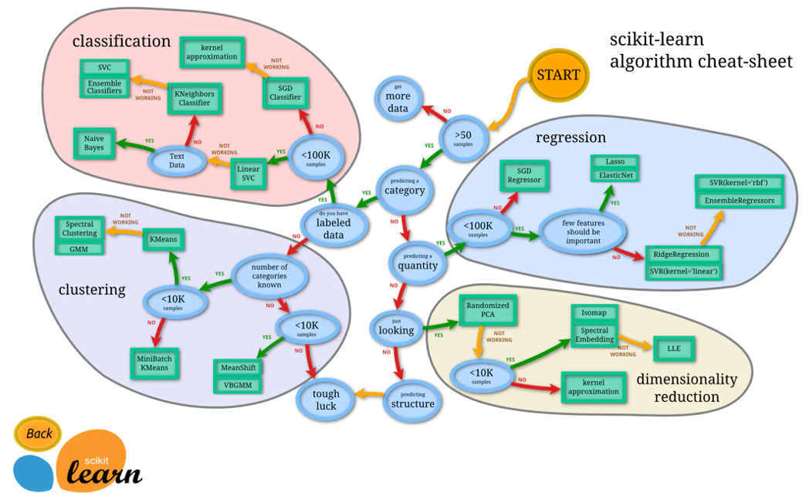
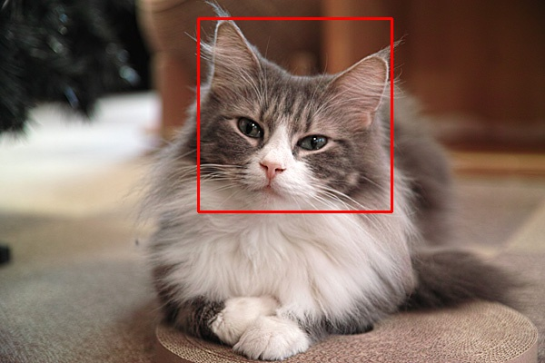
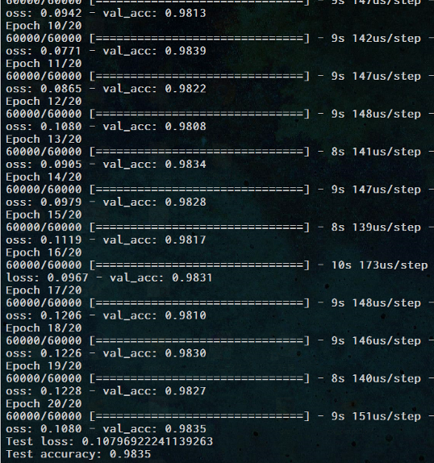
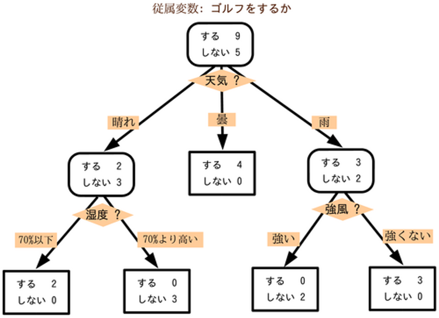

# ML-DL
機械学習、ディープラーニングのあれこれ

## 目的
機械学習系の特訓

## 行ったこと
- 機械学習系の基礎調査
    - knowledge_memo

- カスケードファイルによる猫の画像検知
    - cascade_test

- ニュートラルネットワークによるアイリスの花の種類の分類
    - iris_learning.py

- ディープラーニングによる手書き文字の分類
    - deep_test.py

- その他の機械学習
    - K最近傍法：iris_k.py
    - 重回帰分析：liner.py
    - ロジスティック回帰分析：Logistic_test.py
    - ランダムフォレスト ：randomForest.py
    - SGD分析：SGD_Regression.py
    - SVM：svm_test.py
    - 決定木：tree.py

